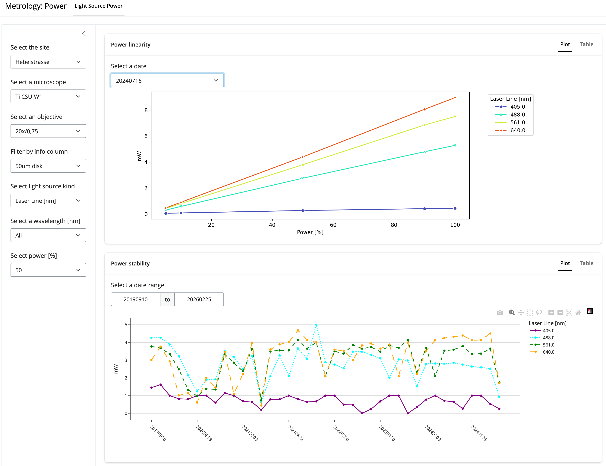

# Table of Contents
1. [Overview](#Overview) <!--This works!-->
2. [Usage](#Usage)
   1. [Data upload](#Data-upload)
      1. [Data upload for PSF measurements](#Data-upload-for-PSF-measurements)
      2. [Data upload for light source power measurements](#Data-upload-for-light-source-power-measurements)
      3. [Data upload for field uniformity and distortion](Data-upload-for-field-uniformity-and-distortion)
   2. [Data visualisation](#Data-visualisation)
3. [Prerequisites](#Prerequisites)
   1. [Google sheet](#Google-sheet)
   2. [Google service account](#Google-service-account)
4. [Running locally](#Running-locally)
   1. [Testing locally](#Testing-locally)
5. [Installation on Linux server](#Installation-on-Linux-server)
   1. [Shiny Server installation](#Shiny-Server-installation)
   2. [Opening the port](#Opening-the-port)
   3. [Shiny Server configuration](#Shiny-Server-configuration)
   4. [Getting metroloshiny](#Getting-metroloshiny)
      1. [Configure private_data csv file](#Configure-private_data-csv-file)
   5. [Deploying the Shiny apps](#Deploying-the-Shiny-apps)
      1. [Deployment automation with pixi](#Deployment-automation-with-pixi)
      2. [Updating metroloshiny](#Updating-metroloshiny)


# Overview

Metroloshiny allows you to visualise microscope metrology data interactively.

It makes use of a google sheet as "database", where new metrology measurements can be uploaded directly from the Shiny app (metroloshiny).




# Usage

As of metroloshiny v0.2.0, it can be used for the visualisation of:
- PSF measurements
- Light source power measurements

The welcome page (server-address:3838) provides links to the different visualisation apps as well as the upload app.

## Data upload

Data upload will write data into a google spreadsheet.

Generally, the spreadsheets contain columns for:
1. Site (Location of the microscope)
2. Microscope (The name of the microscope)
3. Objective (a name or `ID`)
4. Info (any additional information that may be necessary) *
5. Metric kind (may be none or several, e.g. `Laser line`)
6. Measurement columns (named by dates in format YYYYmmdd)

During the upload, the measurements can be associated to existing entries by specifying columns 1-4, using drop-down selections.

Alternatively, new entries (e.g. for a new microscope) can be specified by selecting e.g. `* New microscope *` from the drop-down selection, and providing a new name accordingly.

Upload is protected by password, which is configured in the `private_data.csv` [see here](#Configure-private_data-csv-file).

> [!TIP]
> * Providing some information for the `Info` columns is strongly recommended.

### Data upload for PSF measurements

PSF measurements can be uploaded using metrics retrieved from (your) [OMERO](https://www.openmicroscopy.org/omero/) database.

Images on OMERO must be analysed using the [FIJI](https://fiji.sc) script [PSF Inspector](https://github.com/imcf/imcf-fiji-scripts/blob/master/src/main/resources/scripts/Plugins/IMCF_Utilities/Analyze/PSF%20Inspector.py) by the [IMCF team](https://www.biozentrum.unibas.ch/facilities/technology-platforms/technology-platforms-a-z/overview/unit/imaging-core-facility).

This script uploads key-value pairs to the analysed OMERO images.

1. Select the Metrology Category: `PSF`
2. Select the `Upload from OMERO` tab
2. Provide a dataset ID that contains PSF Inspector analysed images
3. Images of the dataset have PSF metrics will be available via drop-down choice
4. Select an image and specify to which site, microscopy, objective, etc. it belongs
5. A table will be shown and you may have to check:
   - Channel names (modify directly in the table)
   - Adjust the measurement date (via date selection)
7. Provide the upload password
6. By pressing the upload button, the data will be written to the google spreadsheet

### Data upload for light source power measurements

Light source power measurements can be via file currently implemented for 3 specific use-cases:
- A custom Thorlabs power meter [`.csv` file](./example_files/example_thorlabs_powermeter_linearity-DAPI.csv)
- A [Excel file](./example_files/SCF_TLPM_PowerCalibrationOutputFile_test_file.xlsx) generated by Nikon NIS JOB *
- A [simple Excel file](./example_files/example_simple_power_measurement.xlsx), manually created

> [!NOTE]
>* The NIS JOB is currently not publicly available: [Tom Lummen's Nikon JOB for power measurement automation](https://www.protocols.io/view/scf-tlpm-multiobjective-multioc-powercalibration-hf43b3qyp)

1. Select the Metrology Category: `Power`
2. Select the `Upload from CSV` tab
2. Select the file using the file selection dialog
3. Select an image and specify to which site, microscopy, objective, etc. it belongs
4. A table will be shown:
   - You must specify the light source kind: `Laser` or `LED`
   - You may adjust the measurement date (via date selection)
   - You may have to provide further information (e.g. power percentages for the measurements)
7. Provide the upload password
6. By pressing the upload button, the data will be written to the google spreadsheet

### Data upload for field uniformity and distortion

Information on how to analyse images on OMERO will follow.

Follow the instruction for [PSF upload](#Data-upload-for-PSF-measurements), but make sure to select the Metrology Category: `Uniformity/Distortion`

## Data visualisation

You have sidebar drop-down selections to filter for a specific microsocpe entry.

Different cards will give you graphs and additional filtering options.

----

# Prerequisites

## Google sheet

An google sheet document is required.

The document requires specific sheet names and the column names should not be modified either.

An example can be found in `example_files/metroloshiny_data_example.xlsx`. I.e. copy it to your google drive.

Make sure that all sheets already contain at least one entry.

The first sheet entry for a new "site" should be done manually within the sheet.

> [!NOTE]
> - The sheet names may not be changed.
> - The first (common) column names may not be changed (e.g. Site, Microscope, Objective, Info, Channel, FWHM, ...)
> - Date columns must be in format YYYYmmdd (there may be more text after that)

## Google service account

To retrieve (and write) data to the google sheet, metroloshiny requires you to create a service account.

Follow these steps:

**Enable API and services in google:**

1. Create a project or select existing one in [Google Developers Console](https://console.developers.google.com/)
2. In **Search for APIs and Services** search and enable:
   - **Google Drive API**
   - **Google Sheets API**

<!--
## Create a API key for a public google sheet
1. In `APIs & Services` > `Credentials` choose `Create credentials` > `API key`
2. Give it a name (e.g. API key metroloshiny)
3. Optional: apply restrictions (I choose no restrictions)
-->

**Create a service account:**

See also [here](https://docs.gspread.org/en/latest/oauth2.html#for-bots-using-service-account).

1. In `APIs & Services` > `Credentials` choose `Create credentials` > `Service account key`
2. Fill out the form...
3. Under `Credentials` > Service Accounts, press `Manage service accounts`
4. Press on ⋮ near recently created service account and select “Manage keys” and then click on “ADD KEY > Create new key”.
5. Select JSON key type and press “Create” -> downloads a json file. Also remember the service email address
6. Share the google sheet with the service email address created above
7. **Optional:** Move the downloaded file to `~/.config/gspread/service_account.json`. Windows users should put this file to `%APPDATA%\gspread\service_account.json`.
8. I suggest you put the `service_account.json` somewhere you will remember, you will also need the file on the Linux server.

# Running locally

Copy the repo:

`git clone https://github.com/loicsauteur/metroloshiny.git`

Install [pixi](https://pixi.prefix.dev/latest/installation/)

Install the pixi environments (`default` and `dev`)

```bash
cd metroloshiny
pixi install --all
```

Use VS Code with the Shiny extension to apps run locally.

To update the repo to the newest version:

```bash
git pull
pixi install --all
```
>[!NOTE]
>
> For proper version visualisation it may help to have the latest pixi version and to clean the pixi cache & reinstall the environments.
> ```
> git pull
> pixi self-update
> pixi clean
> pixi clean cache
> pixi install --all
> ```
<!--
To bump the version:
- update the version in the index.html
- commit the change
- add a tag
- push
Follow the install instructions before ! I am not sure if local pixi env update is necessary for the push !
-->

## Testing locally

Playwright must be installed in the dev environment before running tests (shiny app test runs):

```bash
pixi run playwright
```

There are 2 different kind of tests:
1. General pytest executed with `pixi run test` (or during committing)
2. Manual test executed with `pixi run manual` (**not** during committing), for tests that rely on e.g. connecting to OMERO.

<!--
Commit changes:
To make use of pre-commit, **need to run git from the dev pixi env**.
-->

# Installation on Linux server

See also [Shiny Server](https://shiny.posit.co/py/get-started/deploy-on-prem.html#deploy-to-shiny-server-open-source).

## Shiny Server installation

Install on a linux (server) execute following commands (for Ubuntu >18.04):

``` bash
sudo apt-get install gdebi-core
wget https://download3.rstudio.org/ubuntu-20.04/x86_64/shiny-server-1.5.23.1030-amd64.deb
sudo gdebi shiny-server-1.5.23.1030-amd64.deb
```
<!--
```
Shiny Server
 Shiny Server is a server program from RStudio, Inc. that makes Shiny applications available over the web. Shiny is a web application framework for the R statistical computation language.
Do you want to install the software package? [y/N]:y
/usr/bin/gdebi:113: FutureWarning: Possible nested set at position 1
  c = findall("[[(](\S+)/\S+[])]", msg)[0].lower()
Selecting previously unselected package shiny-server.
(Reading database ... 125827 files and directories currently installed.)
Preparing to unpack shiny-server-1.5.23.1030-amd64.deb ...
Unpacking shiny-server (1.5.23.1030) ...
Setting up shiny-server (1.5.23.1030) ...
Creating user shiny
Adding LANG to /etc/systemd/system/shiny-server.service, setting to en_US.UTF-8
Created symlink /etc/systemd/system/multi-user.target.wants/shiny-server.service → /etc/systemd/system/shiny-server.service.
● shiny-server.service - ShinyServer
     Loaded: loaded (/etc/systemd/system/shiny-server.service; enabled; vendor preset: enabled)
     Active: active (running) since Thu 2026-03-19 09:12:46 CET; 8ms ago
   Main PID: 3150 (shiny-server)
      Tasks: 6 (limit: 19047)
     Memory: 1.5M
        CPU: 5ms
     CGroup: /system.slice/shiny-server.service
             └─3150 /opt/shiny-server/ext/node/bin/shiny-server /opt/shiny-server/lib/main.js
```
-->

If all goes well, you should see a welcome page on http://hostname:3838/

If the link is not accessible from outside, the port may not be open. Follow the next paragraph.

## Opening the port
If the Shiny Server is not accessible on: http://xx.xx.xx.xx:3838

You may have to open the port  on the linux server, i.e. allow the port with:

`sudo ufw allow 3838`

## Shiny Server configuration

Edit the file `/etc/shiny-server/shiny-server.conf` (root privileges are required). Add a line with python `<path-to-python-or-venv>`.

NB: the python environment will be set up as described in the next section.

In addition it may/should `run_as` my username (`shiny`, did not work for me, maybe also as `ubuntu` might work...).

<!--
# Use specific python to run shiny apps
python /users/stud/s/sautlo01/shiny_test/.pixi/envs/default/bin/python;
-->

Example `shiny-server.conf`:
```bash
# Use specific python to run shiny apps
python /users/path/to/repo/.pixi/envs/default/bin/python;

# Instruct Shiny Server to run applications as the user "shiny", or better your user name
#run_as shiny;
run_as userName;

# Define a server that listens on port 3838
server {
  listen 3838;

  # Define a location at the base URL
  location / {

    # Host the directory of Shiny Apps stored in this directory
    site_dir /srv/shiny-server;

    # Log all Shiny output to files in this directory
    log_dir /var/log/shiny-server;

    # When a user visits the base URL rather than a particular application,
    # an index of the applications available in this directory will be shown.
    directory_index on;
  }
}
```

## Getting metroloshiny

Copy the repo:

`git clone https://github.com/loicsauteur/metroloshiny.git`

Install [pixi](https://pixi.prefix.dev/latest/installation/)

Install the pixi `default` environments:

```bash
cd metroloshiny
pixi install
```

### Configure private_data csv file

You can find an example `example_files/private_data_example.csv`.

This file is needed for metroloshiny. It contains information to access e.g. the google sheets, or OMERO.
This information is stored in this file as comma-separated key value pairs.

The file should be located as follows:
`/path/to/metroloshiny/data/private_data.csv`

- GoogleServiceEmail: service email address created in the [Google service account](#Google-service-account)
- PathToServiceAccountJSON: full path to your `service_account.json` (**you need to save a copy somewhere on your server**)
- Sheet ID: Google sheet ID
- Sheet URL: URL to the google sheet
- Upload password: A password you define, used for uploading data from the metroloshiny app to your google sheet

OMERO entries are optional, in case you want to retrieve data saved on OMERO.

- OMERO HOST: OMERO web-address
- OMERO PORT: OMERO port
- OMERO USER: OMERO user name (e.g. user locally created for your OMERO group)
- OMERO PASSWORD: OMERO password for user

If the default location `path/to/metroloshiny/data/private_data.csv` is not suitable for running on your server, you have to specify the path within the code in `src/metroloshiny/utils/read_fily.py`, line 10-13:

```python
# Path of the private_data.csv file on the linux server
__linux_private_data_path__ = (
    "/absolute/path/to/private_data.csv"
)
```
THIS NEEDS TO BE FIXED FROM MY SIDE... MAYBE I CAN:
- copy the file somewhere else? i.e. in which directory is python started?
- Current working directory: /srv/shiny-server/data_upload
- read_file __file__: /users/stud/s/sautlo01/metroloshiny/src/metroloshiny/utils/read_file.py
   - > Could use the latter to get the relative path to the metroloshiny repo

## Deploying the Shiny apps

As described in the [official documentation](https://shiny.posit.co/py/get-started/deploy-on-prem.html#place-application-files): A Shiny app `app.py` must be located in the shiny-server folder. I.e. Clear out the contents of `/srv/shiny-server/` and replace it with your own app(s).

<!--
- If you’re only hosting a single app, you can put the `app.py` (and the rest of the app’s files) directly in `/srv/shiny-server/`, and it will be served from http://hostname:3838/.
- If you have multiple apps, copy each app into a subdirectory; for example, `/srv/shiny-server/foo/app.py` would be served from http://hostname:3838/foo/. In this case, you can put static assets into the root `/srv/shiny-server/` directory, like an `index.html` file.

E.g. to copy a folder (with all it's content, parameter `-R` for recursive; if destination does not exist it will be created) use:
-->

E.g. copy the one of the metroloshiny apps to the `/srv/shiny-server`:

`cp -R /path/to/metroloshiny/power_at_objective /srv/shiny-server/power_at_objective/`

**In case the destination exists already, remove that folder before copying the new version**

e.g.: `sudo rm -r /srv/shiny-server/power_at_objective/`

Finally, **restart the shiny-server**:

`sudo systemctl restart shiny-server`

### Deployment automation with pixi

For testing code modification it can be useful to create a pixi task:

run: `pixi run deploy`

Please adjust your task accordingly:

`deploy = "sudo rm -r /srv/shiny-server/power_at_objective;sudo cp -R /users/stud/s/sautlo01/metroloshiny/src/metroloshiny/power_at_objective /srv/shiny-server/power_at_objective/;sudo systemctl restart shiny-server"`

In case you changed the dependencies, update also your python environment:

`pixi install`

### Updating metroloshiny

Keep pixi up to date:

`pixi self-update`

Update as follows (using deployment automation):
<!--
'clean' and 'clean cache' will ensure proper version display
-->

```bash
git pull
pixi clean
pixi clean cache
pixi install
pixi run deploy
```


<!--
Random notes:
- Get the total line count in project with:
git ls-files | grep "\.py$" | xargs wc -l
   - or together with the word count:
git ls-files | grep "\.py$" | xargs wc -lw
-->
